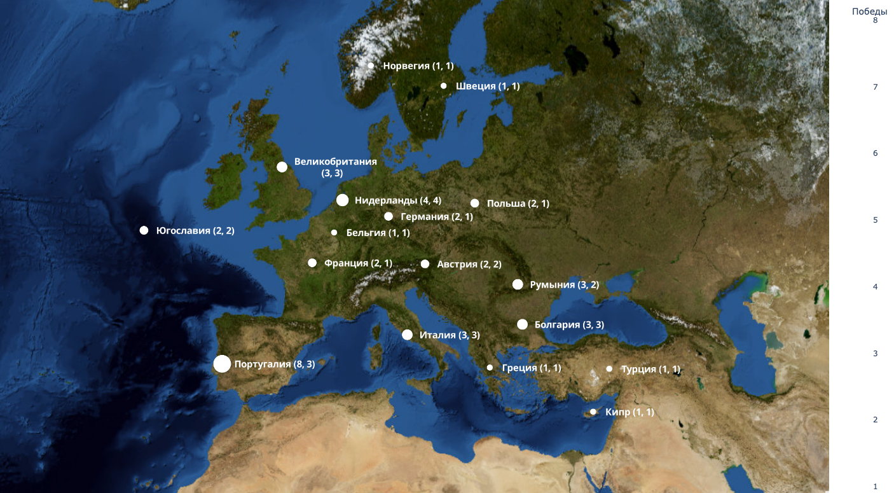

# Python Plotly Geo Map Examples

This repository contains examples of using Plotly to create Bubble Geo Maps.

## Installation

1. Clone the repository:

```bash
git clone git@github.com:lehaSVV2009/plotly-geomap-examples.git
```

2. Setup pyenv

```bash
brew install pyenv
eval "$(pyenv init -)"
pyenv install 3.9.18
pyenv local 3.9.18
python --version
```

3. Install dependencies

```bash
pip install -r requirements.txt

```

4. Run examples

```bash
python golden_ball.py
python golden_boot.py
```

## Examples

### Football





### European Stats

